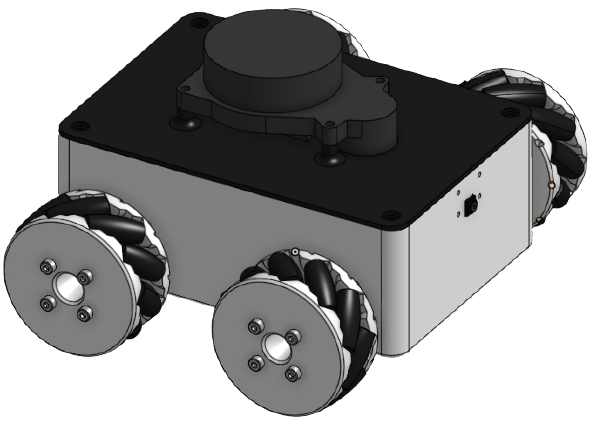
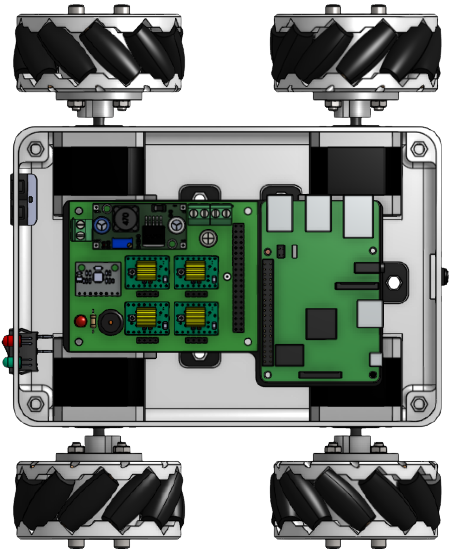
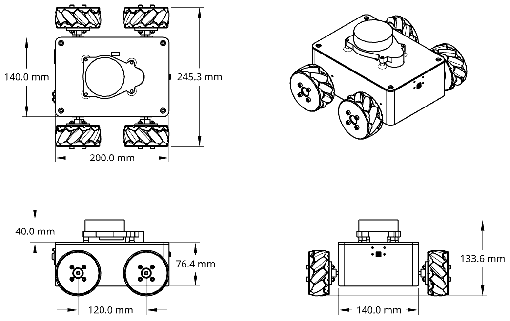

## OmniBot CAD

### Description

This repository contains the **[omniBot](https://github.com/felipemohr/omniBot)** .step, .stl and .x_t files.

The 3d models were designed in **OnShape**. If you want to view the entire project, go to [this link](https://cad.onshape.com/documents/e18008fd6dfa5e394bfbe217/w/5d0c567c5c1cdf1283da7a70/e/cfb7d70bc535503aea561975?renderMode=0&uiState=61ce40eeab1be4741a4f0ede).

Front Isometric View       |  Top Electronics View
:-------------------------:|:-------------------------:
  |   

Check the *'imgs'* folder to see other views.
Here are the robot drawings:

### Resources
Some of the models used to assemble the omniBot were taken from other sources.

- Mecanum Wheels were obtained from **[HowToMechatronics](https://howtomechatronics.com/projects/arduino-mecanum-wheels-robot/)**
- Electronics parts were obtained from **[Grabcad](https://grabcad.com/library)**
- OmniBoard was obtained from **[omniBot_Electronics repository](https://github.com/felipemohr/omniBot_Electronics)**

